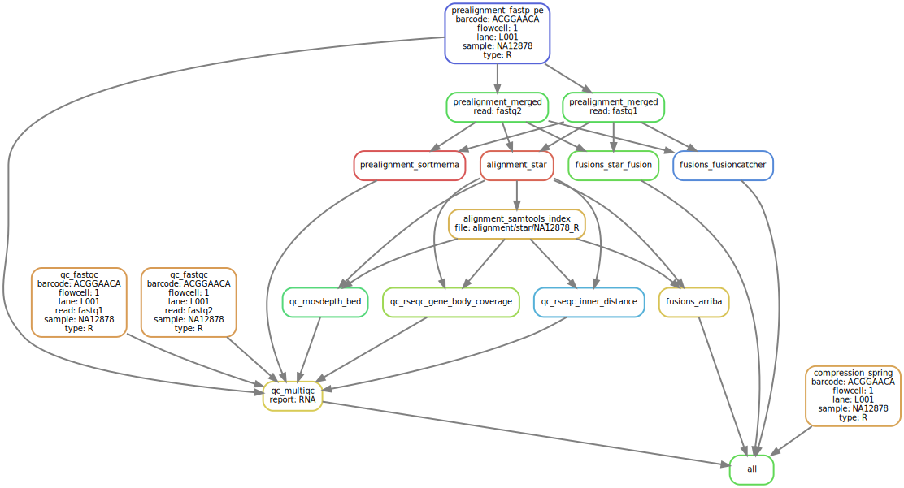

# :crown: WTS Leukemia Königskobra :snake:

Snakemake workflow to analyse hematological malignancies in whole transcriptome data


[](https://opensource.org/licenses/gpl-3.0.html)

## :speech_balloon: Introduction

This snakemake workflow uses modules from hydragenetics to process `.fastq` files and obtain different kind
of fusions in RNASeq data. Alongside tables containing gene fusions, the workflow produces a
multiqc report `.html` file and some qc plots. The following modules are currently part of this pipeline:

- alignment
- compression
- fusions
- prealignment
- qc

## :heavy_exclamation_mark: Dependencies

In order to use this module, the following dependencies are required:

[](https://github.com/hydra-genetics/)
[](https://pandas.pydata.org/)
[](https://docs.nvidia.com/clara/parabricks/3.7.0/index.html)
[](https://www.python.org/)
[](https://snakemake.readthedocs.io/en/stable/)

## :school_satchel: Preparations

### Sample and unit data

Input data should be added to
[`samples.tsv`](https://github.com/clinical-genomics-uppsala/wts_leukemia_konigskobra/blob/develop/config/samples.tsv)
and
[`units.tsv`](https://github.com/clinical-genomics-uppsala/wts_leukemia_konigskobra/blob/develop/config/units.tsv).
The following information need to be added to these files:

| Column Id | Description |
| --- | --- |
| **`samples.tsv`** |
| sample | unique sample/patient id, one per row |
| tumor_content | ratio of tumor cells to total cells |
| **`units.tsv`** |
| sample | same sample/patient id as in `samples.tsv` |
| type | data type identifier (one letter), can be one of **T**umor, **N**ormal, **R**NA |
| platform | type of sequencing platform, e.g. `NovaSeq` |
| machine | specific machine id, e.g. NovaSeq instruments have `@Axxxxx` |
| flowcell | identifer of flowcell used |
| lane | flowcell lane number |
| barcode | sequence library barcode/index, connect forward and reverse indices by `+`, e.g. `ATGC+ATGC` |
| fastq1/2 | absolute path to forward and reverse reads |
| adapter | adapter sequences to be trimmed, separated by comma |

### Reference data

Reference files should be specified in
[`config.yaml`](https://github.com/clinical-genomics-uppsala/wts_leukemia_konigskobra/blob/develop/config/config.yaml)

1. 

## :rocket: Usage

To run the workflow,
[`resources.yaml`](https://github.com/clinical-genomics-uppsala/wts_leukemia_konigskobra/blob/develop/config/resources.yaml)
is needed which defines different resources as default and for different rules.

```bash
snakemake --profile my-profile
```

### Relevant output files

| File | Description |
|---|---|
| `compression/spring/{sample}_{flowcell}_{lane}_{barcode}_{type}.spring` | compressed `.fastq` file pair |
| `qc/multiqc/multiqc_RNA.html` | `.html` report from MultiQC |

## :judge: Rule Graph


